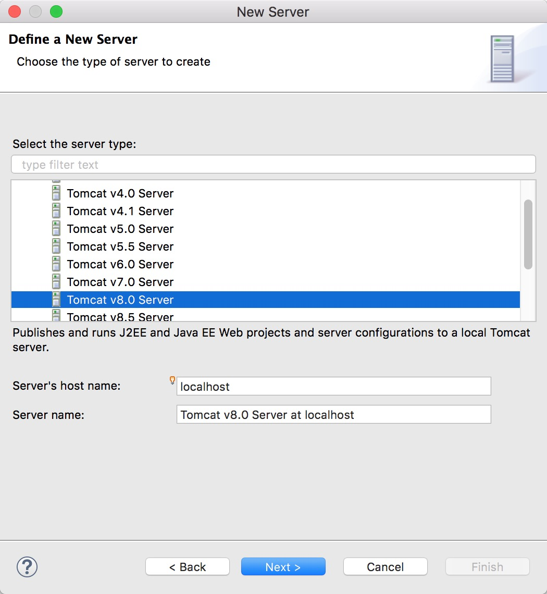
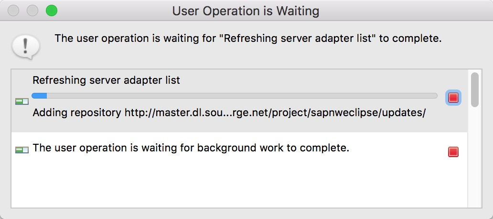
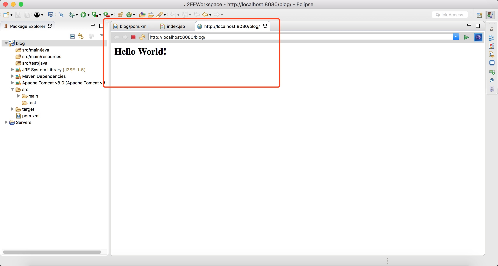
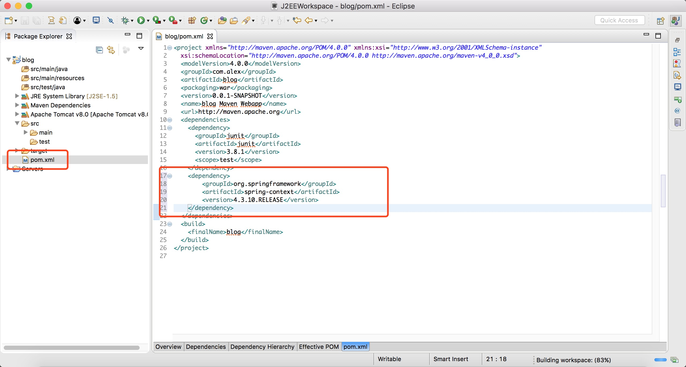

#Eclipse安装Maven详细配置过程

距离上次写博客到现在已经差不懂有两年时间了，不是没时间，就是懒。近期不知道怎么，突然想建个个人博客。现在刚毕业，不小心在公司当起了个假全栈。现在刚从Android那边转过来当起假全栈，现在做到后端这一块，也是边学边做，顺便写写博客，记录一下东西。

最近领养了一只小猫，甚是高兴，只是在写这篇博客的时候他在我旁边一直吵吵要陪他玩呢哈哈。文末将小猫今日的图片一张，并成为我以后写博客的惯例。

现在进入正文。

本机：**MasOs Sierra** Version10.12.4

已经安装环境：**JDK1.8**、**Tomcat8.0**

##步骤一：安装Eclipse
下载地址：[https://www.eclipse.org/downloads/](https://www.eclipse.org/downloads/)


下载完成后双击打开安装包：选择Eclipse IDE for Java EE Developers 安装


等待安装完成。
##步骤二：安装Maven
安装完成Eclipse之后，开始安装Maven

下载地址：[http://maven.apache.org/download.cgi](http://maven.apache.org/download.cgi)

打开页面如下：


往下拖动，直到看到下图，随便选一个下载


下载完成后解压，将解压包放在任意路径（自己安排），示例放在以下路径：

`/Users/apple/J2EEWorkspace/apache-maven-3.5.0`


接下来安装Maven,其实就是配置一下环境变量就可以了。

在命令行终端安顺序输入如下代码：

`vi ~/.bash_profile`


在vim的编辑器下安`i`输入下面的代码：

 `export M2_HOME=/Users/apple/J2EEWorkspace/apache-maven-3.5.0`
 `export PATH=$PATH:$M2_HOME/bin`


然后按`:`并输入`wq`退出并保存。

测试一下是否安装成功：

命令行继续输入：

`mvn -v`

出现如下界面未安装成功


##步骤三：安装m2Eclipse

官方首页：[http://www.eclipse.org/m2e/](http://www.eclipse.org/m2e/)


打开上面那个首页只是想让大家知道知道下面的网址是怎么来的。

上面的网址先放一放，打开Eclipse,点击菜单栏->Help->Install New Software：


然后出现下面的界面并在work with 输入下面的网址，就是上面那个：

`M2Eclipse - http://download.eclipse.org/technology/m2e/releases`


然后逐步安装，看图操作，


这样就算是安装完成啦。

##步骤四：Eclipse设置Maven

该安装的都安装完了，结下来就是需要配置一下Maven，就可以使用啦。

点击菜单栏->Eclipse->Preferences..,接下来如图操作：

其实就是刚刚那个maven的安装地址


继续继续：


为了提高.jar的下载速度，修改setting设置：

setting文件在Maven安装目录/conf/settings.xml


修改setting代码，镜像配置为国内阿里的：

```
  <mirrors>
    <!-- mirror
     | Specifies a repository mirror site to use instead of a given repository. The repository that
     | this mirror serves has an ID that matches the mirrorOf element of this mirror. IDs are used
     | for inheritance and direct lookup purposes, and must be unique across the set of mirrors.
     |
    <mirror>
      <id>mirrorId</id>
      <mirrorOf>repositoryId</mirrorOf>
      <name>Human Readable Name for this Mirror.</name>
      <url>http://my.repository.com/repo/path</url>
    </mirror>
     -->

<mirror>
    <id>alimaven</id>
    <name>aliyun maven</name>
    <url>http://maven.aliyun.com/nexus/content/groups/public/</url>
    <mirrorOf>central</mirrorOf>
  </mirror>

  <mirror>
    <id>uk</id>  
    <mirrorOf>central</mirrorOf>  
    <name>Human Readable Name for this Mirror.</name>  
    <url>http://uk.maven.org/maven2/</url>
  </mirror>

   <mirror>
    <id>CN</id>
    <name>OSChina Central</name>
    <url>http://maven.oschina.net/content/groups/public/</url>
    <mirrorOf>central</mirrorOf>
  </mirror>

  <mirror>
    <id>nexus</id>
    <name>internal nexus repository</name>
    <!-- <url>http://192.168.1.100:8081/nexus/content/groups/public/</url>-->
    <url>http://repo.maven.apache.org/maven2</url>
    <mirrorOf>central</mirrorOf>
  </mirror>
     
  </mirrors>
```

##步骤六：配置Tomcat到Eclipse

**注意**：<br/>
1. 已经配置了的可以不用配置<br/>
2. 没有配置的也可以先创建web项目再配置<br/>
3. 非web项目无需配置

手动配置Tomcat流程：

点击File->New->Other，按图操作配置：





上面红框一个是Tomcat的地址，一个是Java运行环境

##步骤七：测试

万事具备，也差东风。可以一测。现在创建项目测试一下。

创建一个Mavan的Web项目

File->New->Project..


点击Next


选择webapp后继续点Next


输入相应的内容后点击Finish，项目创建完成。

创建完成后发现项目报错了，是index.jsp报错了，此时是因为tomcat没有加载进去，现在加载tomcat到项目中

现在将tomcat加入到项目中


完成最后一步之后，项目就不报错了。

现在点击运行项目



第一次运行比较久。

出现下面界面表示运行成功



我们再用spring-framwork测试一下，用官方示例测试一下

在pom.xml插入下列代码

```
<dependency>
	<groupId>org.springframework</groupId>
	<artifactId>spring-context</artifactId>
	<version>4.3.10.RELEASE</version>
</dependency>
```



然后分别创建3个文件并填入代码如下：

MessageService.java

```
package hello.springframework;

public interface MessageService {
	String getMessage();
}
```

MessagePrinter.java

```
package hello.springframework;

import org.springframework.beans.factory.annotation.Autowired;
import org.springframework.stereotype.Component;

@Component
public class MessagePrinter {
	final private MessageService service;

	@Autowired
	public MessagePrinter(MessageService service) {
		this.service = service;
	}

	public void printMessage() {
		System.out.println(this.service.getMessage());
	}
}
```

Application.java

```
package hello.springframework;

import org.springframework.beans.factory.annotation.Autowired;
import org.springframework.stereotype.Component;

@Component
public class MessagePrinter {
	final private MessageService service;

	@Autowired
	public MessagePrinter(MessageService service) {
		this.service = service;
	}

	public void printMessage() {
		System.out.println(this.service.getMessage());
	}
}
```

最终结构如下：


测试成功结果：


本编教程到此结束，附上今天的小猫。


##看官的赞赏是我写作的动力


